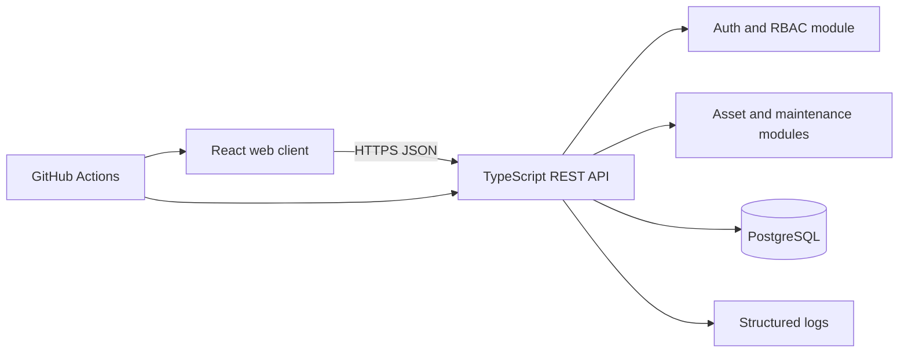

# SYNARI Architecture

**Status:** Proposed MVP architecture

## Decision
Start as a modular monolith: a React/TypeScript client, a TypeScript REST API and PostgreSQL. This keeps deployment and transactions understandable while preserving boundaries for later extraction if real scale requires it. Microservices are intentionally deferred.

## Boundaries
- **Web:** route-level UI, forms, loading/error/empty states and API client. It does not decide authorization.
- **API:** authentication, validation, authorization, transactions, pagination and consistent errors.
- **Domain modules:** assets, assignments/movements, maintenance, users/roles and audit.
- **Database:** normalized transactional records with foreign keys and indexes.
- **Operations:** health endpoints, structured logs and environment-based configuration.

## Authentication and authorization
Use secure cookie-based sessions or short-lived access tokens with a documented refresh strategy. Password hashing, session invalidation, role checks and rate limits belong to the API. The browser must not receive password hashes or secrets.

## Deployment proposal
For an initial deployment, serve the React build from a static host/CDN and run the API as a container against managed PostgreSQL. The exact provider is deferred until the MVP is tested. No deployment is currently claimed.

## Key trade-offs
A modular monolith gives atomic assignment/transfer transactions and a smaller operational surface. PostgreSQL supports constraints, reporting queries and audit relationships. REST and OpenAPI make the boundary inspectable for a future mobile or integration client.
