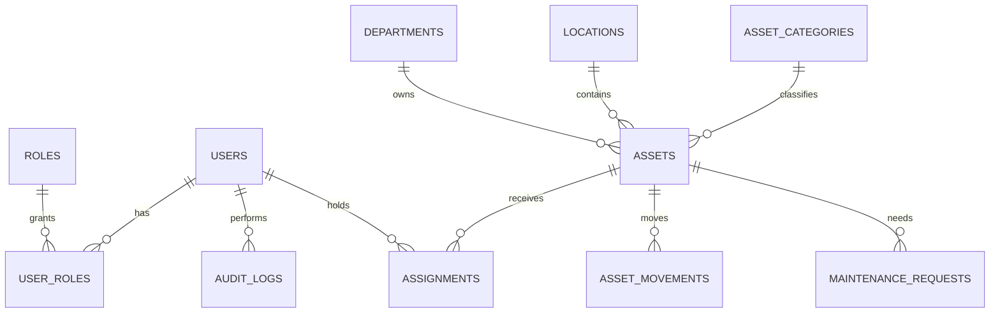

# SYNARI Database Design

**Status:** Proposed schema; migrations not yet implemented

## Entity relationship model

## Tables
- `users`: id, email, display_name, password_hash, active, created_at, updated_at.
- `roles`: id, name; constrained to unique role names.
- `user_roles`: user_id, role_id, assigned_at; composite primary key.
- `asset_categories`: id, name, description, active.
- `departments`: id, name, code, active.
- `locations`: id, name, building, room, active.
- `assets`: id, asset_tag, name, serial_number, category_id, department_id, location_id, status, condition, purchase_date, warranty_until, archived_at, created_at, updated_at.
- `assignments`: id, asset_id, user_id, assigned_at, ended_at, reason; one active assignment per asset enforced by a partial unique index.
- `asset_movements`: id, asset_id, from_location_id, to_location_id, from_department_id, to_department_id, actor_id, reason, created_at.
- `maintenance_requests`: id, asset_id, reporter_id, technician_id, status, description, resolution, opened_at, closed_at, updated_at.
- `audit_logs`: id, actor_id, action, entity_type, entity_id, metadata_json, created_at.

## Constraints and indexes
Use UUID or database-generated identifiers consistently, foreign keys with deliberate delete behavior, unique normalized email/asset_tag/serial_number values where present, check constraints for statuses and dates, and timestamps stored in UTC. Index asset search fields, status/location/department filters, active assignments and recent audit events. Encrypt or minimize any personal data.

## Normalization
Reference categories, departments and locations instead of repeating labels. Keep assignment and movement history append-friendly; `assets` stores current state for efficient reads while history tables preserve transitions.
